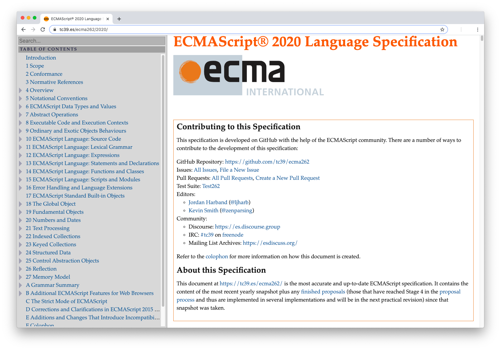

# Notas de aulas

## ES5 vs ES6+
<!-- 112. ES5 vs ES6+ ("Next Gen JS") - Evolution of JavaScript -->

- ES5 é uma linguagem por trás do JavaScript, conhecido como "ECMA / Script"

    Já que mudanças na estrutura poderiam danificar os sites que já usavam a linguagem, vem a necessidade de criar novas versões:

- ES6+ foi criado com melhorias: _const_ e _let_, por exemplo. 

## _Var_ & _Let_ & _Const_
<!-- 113. var vs let & const - Introducing "Block Scope" -->

- ***Var***: cria uma variável; _usado no escopo de function e global_.<br>
- ***Let***: cria uma variável; _usado no escopo de bloco_.<br>
- ***Const***: cria uma constante; _usado no escopo de bloco_.<br>

    O _Var_ redeclara a variável sem anunciar nada, e esse é o problema. Não é a intenção do programador, na maior parte dos casos. Sendo assim, diante de uma redeclaração de variável, é preferível que um erro apareça no console - o que é proporcionado pelo _Let_.
    
    Esse não é o único problema: ela se restringe ao escopo _global_ e ao de _function_. Isso significa que, caso o _bloco_ (ex: **if**) não seja _function_ o suficiente, o _Var_ declarado dentro será considerado global. Ex:

    ```js
        if (tal === 'tal') {
            var algo = 'sei la' // essa var pode ser usada fora.
        }
    ```

    É por isso que o _Let_ será restringindo a qualquer 'bloco'. Neste caso, ele não seria usado fora do _if_. <br> 
    NÃO HÁ PORQUE USAR 'VAR' NO JAVASCRIPT MODERNO.<br>
    ***OBS: Blocos são marcados por chaves ( {...} ), ex: const exemplo = () => {BLOCO}.***

## Hoisting
<!-- 114. Understanding "Hoisting" -->

Você precisa declarar a variável antes de começar a usá-la. Não pode declará-la após chamá-la no console.log, por exemplo.

## Strict Mode e organização
<!-- 115. Strict Mode & Writing Good Code -->

Se você declarar um objeto sem ```var, let``` ou ```const```, ele automaticamente será considerado um ```var```.

Se escrever isso no começo do documento, irão parar de ser consideradas as _var_ automáticas:

    'use strict'    

__As consideradas _var_ automáticas são conhecidas como variáveis não declaradas__.

## Como um código é _parsed_ e _compiled_
<!-- 116. How Code is Parsed & Compiled -->

